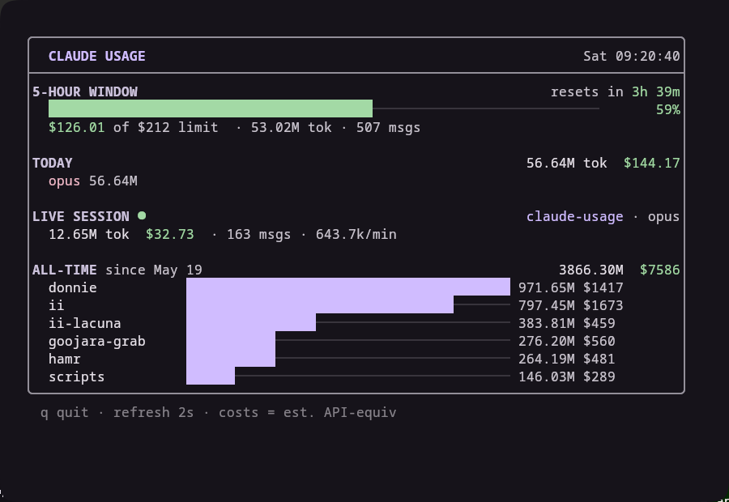

# claude-usage

A live, terminal usage tracker for [Claude Code](https://claude.com/claude-code). Parses the local session logs and shows your token burn and estimated API-equivalent cost in real time.



## What it shows

- **5-hour window** — cost-equivalent burn in the current rolling 5-hour block, with a reset countdown. The percentage is scaled against a **cost budget** (cost is used rather than raw tokens because it already weights output, cache-creation, and cache-reads the way the real plan limit does — cache reads alone are ~97% of raw tokens and barely count). Calibrate the budget to match your actual Claude usage %, see below.
- **Today** — tokens and estimated cost, broken down by model.
- **Live session** — the session you're working in right now, with tokens/min.
- **All-time** — per-project breakdown across every session.

Costs are *estimated API-equivalent* (subscription users don't pay per token) using the `PRICING` table at the top of `tracker.py`.

## How it works

Reads `~/.claude/projects/*/*.jsonl`, pulling `usage` (input / output / cache-create / cache-read tokens) and `model` from every assistant message. Events are deduped by `uuid` and files are re-parsed incrementally via an mtime+size cache, so refreshes stay cheap. The 5-hour window uses `ccusage`-style blocks (hour-floored, new block on a >5h gap).

## Usage

```sh
bin/claude-usage          # run in the current terminal
bin/claude-usage --once   # print one frame and exit
bin/claude-usage-float    # floating kitty window (class: claude-usage-tui)
```

`q` quits. Refreshes every 2s.

### Calibrating the 5-hour budget

The real plan limit is opaque and model-weighted, so calibrate it once against the official percentage (Claude Code's `/usage`, or the web app). While it shows, say, 59%:

```sh
claude-usage --calibrate 59     # back-solves and saves the cost budget
claude-usage --set-budget 212   # or set the dollar budget directly
```

This writes `~/.config/claude-usage/config.json`. `CLAUDE_USAGE_COST_BUDGET` overrides it. Uncalibrated, the bar falls back to your *median* historical block ("typical").

## Install

```sh
ln -s "$PWD/bin/claude-usage" ~/.local/bin/claude-usage
ln -s "$PWD/bin/claude-usage-float" ~/.local/bin/claude-usage-float
```

Stdlib Python only — no dependencies.

## Theming

If `~/.local/state/quickshell/user/generated/colors.json` (a [matugen](https://github.com/InioX/matugen) Material 3 palette) exists, colors are read from it every frame, so the UI tracks your wallpaper. Otherwise it falls back to sensible defaults.
